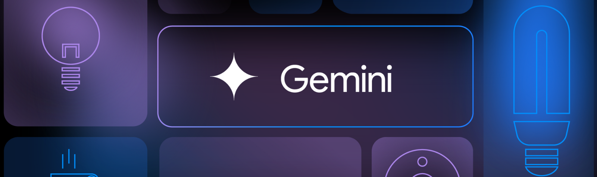

<div align="center">
  
  <p><small>Image source: <a href="https://developers.googleblog.com/en/the-gemini-api-and-the-internet-of-things/">Google Developers Blog</a></small></p>
</div>

# Gemini Desktop
Gemini Desktop is a Tauri-based application that wraps Google's Gemini web interface into a convenient desktop application.

## Features

- Native desktop experience for Gemini web interface
- Convenient access to Gemini from your desktop
- Cross-platform support (Windows, macOS, Linux)

## Tech Stack

- [Tauri](https://tauri.app/) - Desktop application framework
- [React](https://reactjs.org/) - Frontend UI library
- [Google Gemini Web](https://gemini.google.com/) - AI interface

## Getting Started

### Prerequisites

- Node.js (v16 or higher)
- Rust (latest version)

### Installation

1. Clone the repository
```bash
git clone https://github.com/yourusername/gemini-desktop.git
cd gemini-desktop
```

2. Install dependencies
```bash
npm install
```

3. Run development server
```bash
npm run dev
```

### Build

```bash
npm run build
```

## License

MIT License - See [LICENSE](LICENSE) file for details
